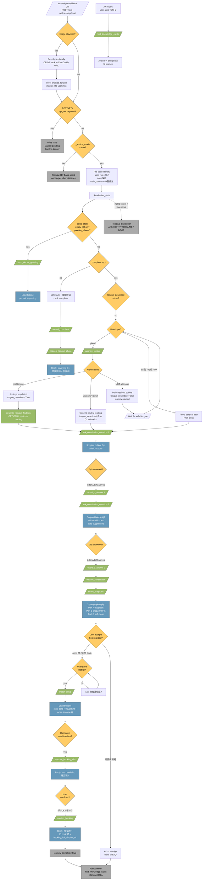

# TCM Jessica Sales Flow — Node-by-Node Map

**Mapped from live code as of 2026-04-28** (commits up to `779754b`).
Equivalent to an n8n / Dify visual workflow but expressed in Mermaid + structured prose.

---

## Quick map (Mermaid)



---

## 1. Entry / Routing layer

| Node | Where | Action | Output |
|------|-------|--------|--------|
| **Entry** | `src/whatsapp/router.py:webhook` OR `src/web.py:disease_chat` | Receive inbound message + attachments | Pass to processing pipeline |
| **Image detection** | `router.py:1164` | Wide check: `att_type ∈ {image, imagemessage, photo}` OR `mimetype.startswith("image/")` | Triggers Jessica v2 image branch |
| **Local save** | `router.py:1180-1209` | Try `download_media()` → save bytes to `MEDIA_PATH/wa/{user_id}/{uuid}.jpg` | Inject marker `(系統提示: ... call analyze_tongue(image_url=/media/wa/...))` |
| **URL fallback** | `router.py:1232-1257` | If save fails, inject ORIGINAL ChatDaddy https URL | analyze_tongue uses ChatDaddy auth |
| **Apology fallback** | `router.py:1264-1290` | If both fail | Inject "couldn't fetch photo, ask for retry" marker |
| **Opt-out keyword** | `router.py:1011` (`停 / unsubscribe`) | Cancel all pending follow-ups + persist opt-out | Send ack message |
| **RESTART keyword** | `router.py:715-720` (`RESTART / 重新開始 / 重置 / 清除記憶`) | Wipe patient row + sales state + queues + ChatDaddy + AOS CRM | Send "I forgot everything" message |
| **Selective cancel** | `router.py:1052-1068` | On any reply: cancel `welcome_checkin` (always), cancel `symptom_followup` / `emotional_checkin` if `resolution_detector.is_resolved()` matches | Removes stale follow-ups |

---

## 2. Agent decision: which mode?

```
_jessica_mode = SALES_AGENT_V2_ENABLED env=true
                AND configs/{slug}.yaml agent.sales_agent_v2_enabled=true
                AND not is_journey_complete(patient)
```

- **TRUE** → load `build_jessica_prompt()` (~1.5k tokens), use 13 sales tools
- **FALSE** → standard agent prompt + standard tools (`find_knowledge_cards`, `save_patient_data`, etc.)

---

## 3. Jessica's 13 tools — registry

| Tool | Phase | Pre-condition | Side effects |
|------|-------|---------------|--------------|
| **`send_doctor_greeting`** | 0 (intro) | `sales_state` empty OR only `greeting_shown=True` (stale flag) | Queue lead bubble + portrait photo, set `greeting_shown=True` |
| **`record_complaint`** | 1 | None | Set `complaint`, `complaint_recorded_at` |
| **`request_tongue_photo`** | 2 | `complaint` set | Set `tongue_requested=True` (unblocks Q1 even if no photo) |
| **`analyze_tongue`** | 3 | `complaint` set; idempotency: blocks if `tongue_described=True` AND real findings | 3-tier vision cascade → set `tongue_findings`, `tongue_described`. **NEW**: not-a-tongue path keeps `tongue_described=False` |
| **`describe_tongue_findings`** | 3.5 (optional) | `tongue_findings` exists | Override auto-queued reading with LLM-written richer one |
| **`ask_constitution_question(n)`** | 4-5 | `n=1`: tongue step done; `n=2`: Q1 answered. Idempotency: blocks if already answered OR `q{n}_asked=True awaiting answer` | Queue scripted bubble (Q1 or Q2 with A/B/C), set `q{n}_asked=True` |
| **`record_q_answer(n, letter)`** | 4-5 | `q{n}_asked=True` | Persist `constitution_answers.q{n}` |
| **`declare_constitution`** | 6 | Q1 + Q2 both answered | Compute distribution, set `dominant_constitution`, `secondary_constitution`, `constitution_distribution`. Returns product info |
| **`share_diagnosis`** | 6.5 | `dominant_constitution` set; idempotency: blocks if already shared | Validate diagnosis ≥15ch + has constitution name; validate pitch ≥15ch + has product name + URL. **Queue product photo (Maca)**. Set `diagnosis_shared=True` |
| **`match_clinic(district)`** | 7 | `diagnosis_shared=True`; reject regional umbrella ("九龍" / "Kowloon"); idempotency: blocks if `matched_clinic_id` already set | Pick nearest Care Plus clinic, queue lead bubble (clinic card + travel hint + time-question) |
| **`propose_booking_slot(date_hint, time_hint)`** | 8 | `matched_clinic_id` set | Walk forward 14 days from HKT today, find first open slot, set `proposed_booking_date`, `proposed_booking_time` |
| **`confirm_booking`** | 9 | clinic + date + time all set | Set `booking_confirmed=True`, `journey_complete=True`, `booking_confirmed_at` (HKT-aware ISO). Returns `booking_full_display_zh` for verbatim use |
| **`find_knowledge_cards`** | ANY | None | Q&A retrieval (out-of-journey questions answered, then return to journey) |

---

## 4. Stage state machine

Each turn the LLM:
1. Reads `sales_state` from `patient.clinical.sales` (live JSON in prompt)
2. Decides current stage based on which keys are set/unset
3. Calls the right tool(s)
4. Writes a SHORT reply (the heavy content goes via lead/scripted bubbles)

```
sales_state progression:
  {} 
    → {greeting_shown: true}
    → {greeting_shown, complaint, complaint_recorded_at, tongue_requested}
    → + {tongue_findings, tongue_described, tongue_description_text}
    → + {q1_asked, constitution_answers: {q1}}
    → + {q2_asked, constitution_answers: {q1, q2}}
    → + {dominant_constitution, secondary_constitution, constitution_distribution}
    → + {diagnosis_shared, diagnosis_text, product_pitch_text}
    → + {user_district, matched_clinic_id}
    → + {proposed_booking_date, proposed_booking_time}
    → + {booking_confirmed, journey_complete, booking_confirmed_at}
```

---

## 5. Vision cascade (analyze_tongue internals)

```
            ┌─────────────────────────┐
            │  _fetch_image_bytes     │
            │  /media/wa/* → disk     │
            │  https:// → HTTP fetch  │
            │  chatdaddy.* → +Bearer  │
            └────┬───────────┬────────┘
                 │ ok        │ exception
                 │           │
                 ▼           ▼
            image_bytes    fetch_failed=True
                 │              │
                 │              └─→ skip vision → vision_failed=True
                 ▼
        ┌─────────────────────────────┐
        │ Tier 1: Anthropic           │  ← claude-sonnet-4-5
        │ claude-sonnet-4-5           │     best on tongue
        └────┬───────────┬────────────┘
             │ ok        │ raise OR weak
             │           │
             ▼           ▼
        valid findings  Tier 2: Groq
                        llama-4-scout
                        ┌────┬────────┐
                        │ ok │ raise/weak
                        ▼    ▼
                    valid  Tier 3: OpenAI
                           gpt-4o
                           ┌────┬────────┐
                           │ ok │ all fail
                           ▼    ▼
                       valid  vision_failed=True

After cascade — three-class outcome:
  1. valid findings           → real reading
  2. fetch_failed             → fake generic ("脷相收到啦 🌿 整體睇落...")
  3. vision_failed (no real)  → fake generic
  4. had_explicit_refusal     → polite redirect ("呢張似乎唔係脷相...")
```

`_is_weak()` bumps `had_explicit_refusal=True` when any tier's summary
matches `_REFUSAL_HINTS` (`"not a tongue" / "唔係舌頭" / "logo" / "screenshot" / "promotional" / etc.`).

---

## 6. Bubble taxonomy (3 channels per turn)

| Channel | Source | Render position | Purpose |
|---------|--------|-----------------|---------|
| **Lead bubbles** | `_queue_lead_bubble(text, user_id)` | Sent FIRST as own messages with typing pause | "What the doctor saw" — tongue reading, clinic card, doctor portrait greeting |
| **LLM reply text** | `final_text` from agent | Sent merged with scripted bubbles via `\n\n` | Short transitions, acknowledgements, soft-closes |
| **Scripted bubbles** | `_queue_scripted_bubble(text, user_id)` | Sent AFTER LLM reply (merged) | Q1/Q2 verbatim — bypasses LLM character drift |
| **Media attachments** | `_queue_media(url, kind, user_id)` | Sent as ChatDaddy image attachments after text | Doctor portrait, Maca product photo |

All four queues are **per-user** since `0599a6f` — no cross-user leak.

---

## 7. Post-processing pipeline (every turn, after LLM reply)

```
final_text from LLM
    ↓
1. _enforce_role_question_first  ← onboarding gate
    ↓
2. _enforce_next_onboarding_field
    ↓
3. _strip_proactive_clinical_on_completion
    ↓
4. _enforce_single_onboarding_question
    ↓
5. _enforce_single_phase2_question
    ↓
6. _strip_repeated_questions
    ↓
7. _clean_token_loops  ← collapse 好好好
    ↓
8. Lead-bubble ack suppression  ← drop short '好' after lead
    ↓
9. Q2 transition suppression  ← wholesale drop reply if ask_constitution_question(2) ran
    ↓
10. add_emojis_to_response
    ↓
11. Backtick/markdown cleanup
    ↓
─── if _jessica_mode ───
12. url_repair  ← fix mangled drgracie URLs
    ↓
13. intro_dedup  ← strip repeated 脷相收到啦 (gated: NOT on tongue-tool turn)
    ↓
14. safety_check  ← profanity de-escalation, etc.
    ↓
15. _enforce_mandatory_keywords
    ↓
16. Bubble splitter (\\n\\n separates paragraphs)
    ↓
final response → drain lead/scripted/media queues for THIS user
    ↓
return JSON to web/whatsapp router
```

---

## 8. Side flows

### A. Photo deferral
**Trigger:** user replies "等下影" / "OK" / "知喇" / "冇相" / "影唔到" after tongue request
**Flow:** LLM calls `ask_constitution_question(1)` directly (no tongue findings) → Q1 fires; tongue is bonus, not blocker
**State:** `tongue_requested=True, tongue_findings={}, tongue_described=False`

### B. Mid-journey FAQ
**Trigger:** user asks unrelated TCM question ("幾錢?", "點影?", "穴位")
**Flow:** LLM calls `find_knowledge_cards(query)` → answers from Qdrant cards → soft-bring-back to next journey step
**No state change** — sales_state unchanged

### C. Refusal / escape
**Trigger:** user says "唔 book 啦" / "等我諗下" / "唔使住"
**Flow:** LLM acknowledges warmly, journey pauses; subsequent messages auto-route to FAQ mode (still Jessica prompt, but no push)

### D. Reactive constitution dispatcher
**File:** `src/proactive/reactive_dispatcher.py`
**Trigger:** user asks 調理 / 補身 / 點改善 questions AND constitution signal is low
**Decision:** `evaluate()` returns `Decision(ASK | RETRY | RESUME | DROP | PASSTHROUGH)`
- **ASK** → inject diagnostic question (e.g. 你係咪成日口乾?) before answering original
- **RESUME** → user answered cleanly → score + answer original question via cached card_ids
- **RETRY** → user reply unclear → re-ask gentler
- **DROP** → 2nd unclear OR pivot → apologise briefly, answer current message

### E. Wait mode (tongue pending)
**Trigger:** `tongue_requested=True` but no `tongue_findings` + user says non-deferral non-photo content
**Flow:** Short ack, NO new question, gentle remind to send tongue. Photo deferral still wins if user explicitly defers.

---

## 9. Proactive triggers (background, scheduled)

Fire AFTER each turn based on detection. Dispatched by 60s polling loop.

### Detection-driven (regex on user message)
| Trigger | Delay | Detection |
|---------|-------|-----------|
| `emotional_checkin` | 24h | distress regex (擔心 / 好辛苦 / 壓力大 / stressed / etc.) |
| `symptom_followup` | 48h | symptom regex (失眠 / 頭痛 / 經痛 / etc., captured for slot) |

### Funnel-driven (sales-state stage)
ONE candidate per turn — most-advanced incomplete stage only.
| Trigger | Delay | When fires |
|---------|-------|-----------|
| `funnel_complaint_pending` | 24h | greeting shown, no complaint |
| `funnel_tongue_pending` | 24h | complaint set, no tongue ack |
| `funnel_q1_pending` | 24h | tongue done, no Q1 |
| `funnel_q2_pending` | 24h | Q1 done, no Q2 |
| `funnel_booking_pending` | 48h | diagnosis shared, no clinic |

### Cancel-on-progress
Each turn after agent runs, sweep stale funnel triggers via `cancel_by_trigger_types()` based on completed stages.

### Reactive (in-turn dispatcher) — see Side Flow D

### Disabled by design
- `welcome_checkin` (intrusive)
- `constitution_journey` 9-Q (Phase 0 — see `docs/plans/constitution-journey-proactive-wiring.md`)

---

## 10. Pipeline trace (debug instrumentation)

Every turn produces a `pipeline_trace[]` event stream rendered in the Flow Inspector right-pane. Event types:

| Status | Meaning |
|--------|---------|
| `pass` | Gate passed, expected path |
| `fail` | Gate rejected, alt path taken |
| `skip` | Gate not applicable this turn |
| `fired` | Action triggered (ack suppression, intro dedup, etc.) |
| `noop` | Gate ran but produced no change |
| `error` | Exception caught (turn continues) |

Gates instrumented:
```
input_received → jessica_identity_seed → onboarding_gate
  → preflight_extractor → classifier (timed) → rules_injected
  → post_emergency_state → system_prompt_build (timed)
  → sos_short_circuit → reactive_constitution → forced_tool_choice
  → iter0_tool_guard_retry → sufficiency_gate → safety_guards
  → mandatory_keywords → url_repair → intro_dedup
```

---

## 11. Persistence layer

| What | Where | Lifecycle |
|------|-------|-----------|
| Patient state (identity, clinical, sales, journey) | SQLite `patients.db` | Survives restarts |
| Disease sessions (history, turn count) | SQLite + in-memory `_disease_sessions` | Survives restarts |
| Pending bubble/media queues | In-memory dict-by-user | Wiped on restart (correct) |
| Scheduled proactive messages | SQLite `proactive.db` | Survives restarts |
| Opt-out list | SQLite `opt_outs` | Survives restarts |
| Greeting tracker | In-memory `_greeting_queued_user_ids` set | Wiped on restart (re-fires intro photo correctly) |
| Phone → disease mapping | SQLite + JSON file | Survives restarts |

---

## 12. Hardcoded URLs / paths

| Asset | URL | Local path |
|-------|-----|------------|
| Doctor portrait | `https://dr-baba-agent.onrender.com/static/sales/hong_doctor.jpg` | `static/sales/hong_doctor.jpg` |
| Maca product | `https://dr-baba-agent.onrender.com/static/sales/maca_product.jpg` | `static/sales/maca_product.jpg` |
| User-uploaded tongue (WhatsApp) | `/media/wa/{user_id}/{uuid}.jpg` | `MEDIA_PATH=/opt/dr-baba-data/media/wa/...` |
| User-uploaded tongue (Web) | `/media/uploads/{session}/{uuid}.{ext}` | `MEDIA_PATH/uploads/...` |
| Product page | `https://www.drgracie.com.tw/products/dr-gracie...` (canonical, set in `configs/tcm-sales-flow.yaml`) | — |

---

## 13. Configuration files

```
configs/tcm-wellness.yaml    ← disease config (proactive_triggers, agent flags)
configs/tcm-sales-flow.yaml  ← sales journey config (clinics, products, doctor info)
configs/template.yaml        ← scaffold for new diseases
render.yaml                  ← env vars (SALES_AGENT_V2_ENABLED, MEDIA_PATH, etc.)
```

---

## 14. End-to-end "happy path" turn-by-turn

```
T1  user: "hi"
    bot:  Lead: 你好 🌿 我係 洪煊宜 Jessica, 心宜中醫 嘅註冊中醫師 👩‍⚕️
                請問你邊度唔舒服？
          Media: hong_doctor.jpg
    state: greeting_shown=True

T2  user: "我胃唔舒服"
    bot:  "聽到你胃唔舒服，真係好辛苦 😔 係咪食完先覺得唔舒服？
           中醫講『望聞問切』，可唔可以影張條脷俾我睇下 👅"
    tools: record_complaint, request_tongue_photo
    state: + complaint, tongue_requested

T3  user: <tongue photo>
    bot:  Lead: 睇到你條脷偏紅、苔薄少 🌿 傾向有少少陰虛
          Reply: 等我再多問你兩條題 😊
                 + Q1 scripted bubble
    tools: analyze_tongue, ask_constitution_question(1)
    state: + tongue_findings, tongue_described, q1_asked

T4  user: "B"
    bot:  (LLM reply suppressed — Q2 turn)
          Q2 scripted bubble alone
    tools: record_q_answer(1, B), ask_constitution_question(2)
    state: + constitution_answers.q1, q2_asked

T5  user: "C"
    bot:  Part A: "根據你嘅脷相 + 答案，你可能主要屬於 陽虛質 🌿..."
          Part B: "呢個體質啱用 Dr. Jessica 極致黑G瑪卡 ✨ ... 👉 [URL]"
          Part C: "如果想更精準調理，可以嚟 clinic 見醫師面診 🌿"
          Media: maca_product.jpg
    tools: record_q_answer(2, C), declare_constitution, share_diagnosis
    state: + constitution_answers.q2, dominant_constitution, diagnosis_shared

T6  user: "好呀我住沙田"
    bot:  Lead: clinic card (Care Plus 沙田 + 地址 + 交通 + 時間 + 你想幾時過嚟?)
          Reply: "好" (auto-suppressed if short)
    tools: match_clinic("沙田")
    state: + user_district, matched_clinic_id

T7  user: "聽日下午"
    bot:  "好呀, 我幫你預咗 4月29日（星期三）下午 3:30, OK 嗎?"
    tools: propose_booking_slot("聽日", "下午")
    state: + proposed_booking_date, proposed_booking_time

T8  user: "好"
    bot:  "搞掂啦 ✨ 已經幫你 book 咗 2026年4月29日（星期三）下午3:30，
           地址 沙田乙明邨明信樓地下，到時見 🌿"
    tools: confirm_booking
    state: + booking_confirmed=True, journey_complete=True

T9+ user: "點搽暗瘡膏好?"
    bot:  (FAQ mode) — find_knowledge_cards → answer
```

---

## 15. Where to extend

| Want to add… | Where to start |
|--------------|---------------|
| New journey step | Add to `_JOURNEY_STEPS` in `sales_prompt.py:23` + new tool in `tools/sales.py` + dispatch in `handle_sales_tool_call()` |
| New proactive trigger | `proactive/trigger_detector.py:scan()` + template in `templates.py` + config in disease YAML |
| Different vision provider | `tools/sales.py:_vision_describe_tongue_*` (3 functions, one per tier) |
| New disease config | Copy `configs/template.yaml` → `configs/<slug>.yaml`; create `data/cards/<slug>-...` directory; index via `scripts/index_all.py` |
| Skip onboarding for a disease | Set `agent.sales_agent_v2_enabled: true` (Jessica path bypasses standard onboarding) |
| Change journey order | Edit `_JOURNEY_STEPS` AND each tool's precondition in `tools/sales.py` |
| Disable a proactive trigger | Flip `enabled: false` in `proactive_triggers.<name>` in disease YAML — no redeploy needed |
